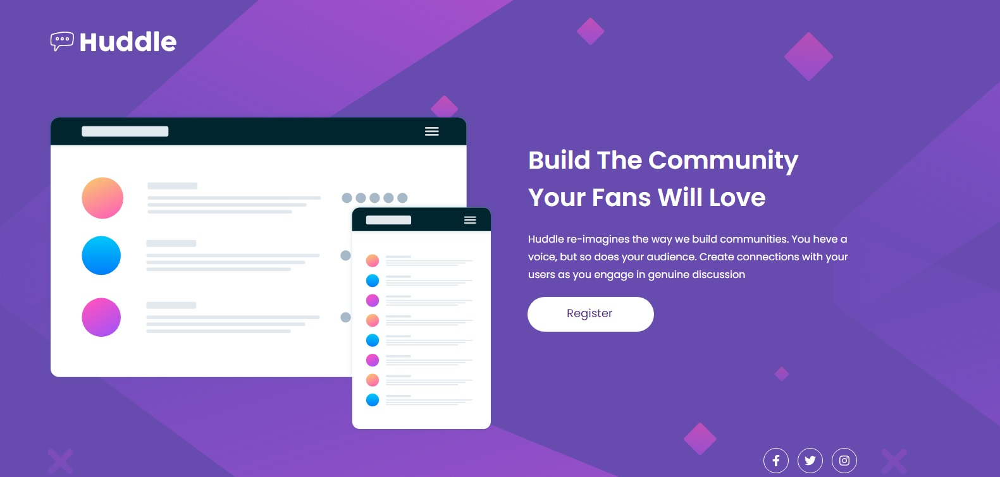
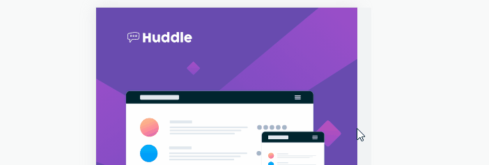
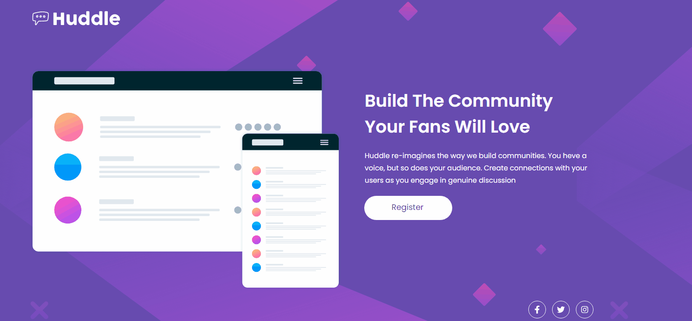

# README - Quest HTML + CSS Avançado
Exercício proposto pelo curso DevQuest, para desenvolvermos um layout de um site em HTML e CSS, usando o FLEX, GRID e outros conhecimentos adquiridos durante o curso até o presente momento. 🚀🚀 

Abaixo está a imagem do layout que deveria ser reproduzido.

[]

[]

[]

Abaixo está as imagem do layout reproduzido por mim: 

[]

[]

[]

## Tecnologias Utilizadas
- HTML
- CSS

## Dificuldades Enfrentadas
- Tivemos dificuldade no momento de tornar o layout responsivo, ou seja, na hora de usar as Media Queries. Alguns elementos do noss9o layout na hora da responsividade deram bastante trabalho em fazermos os alinhamentos pedidos no exercício.
